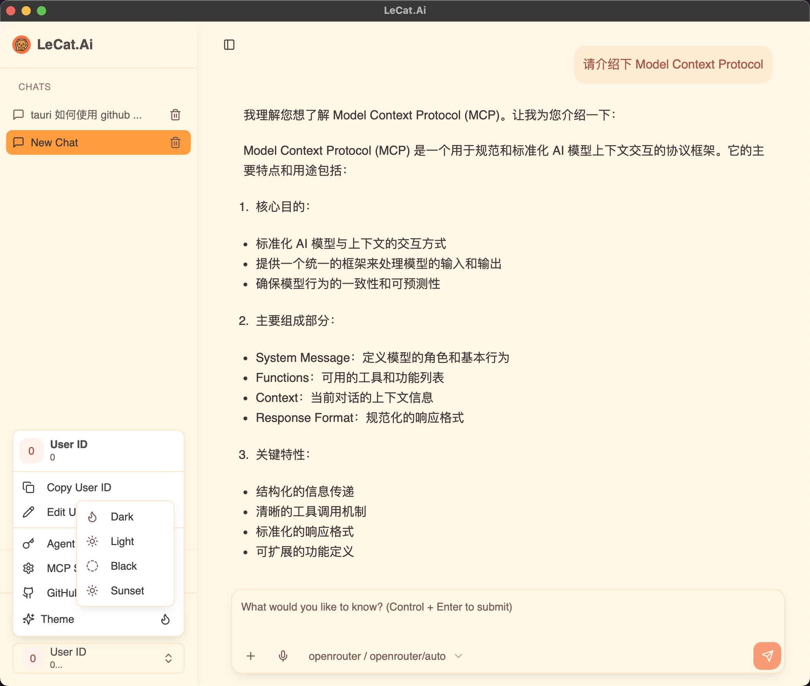
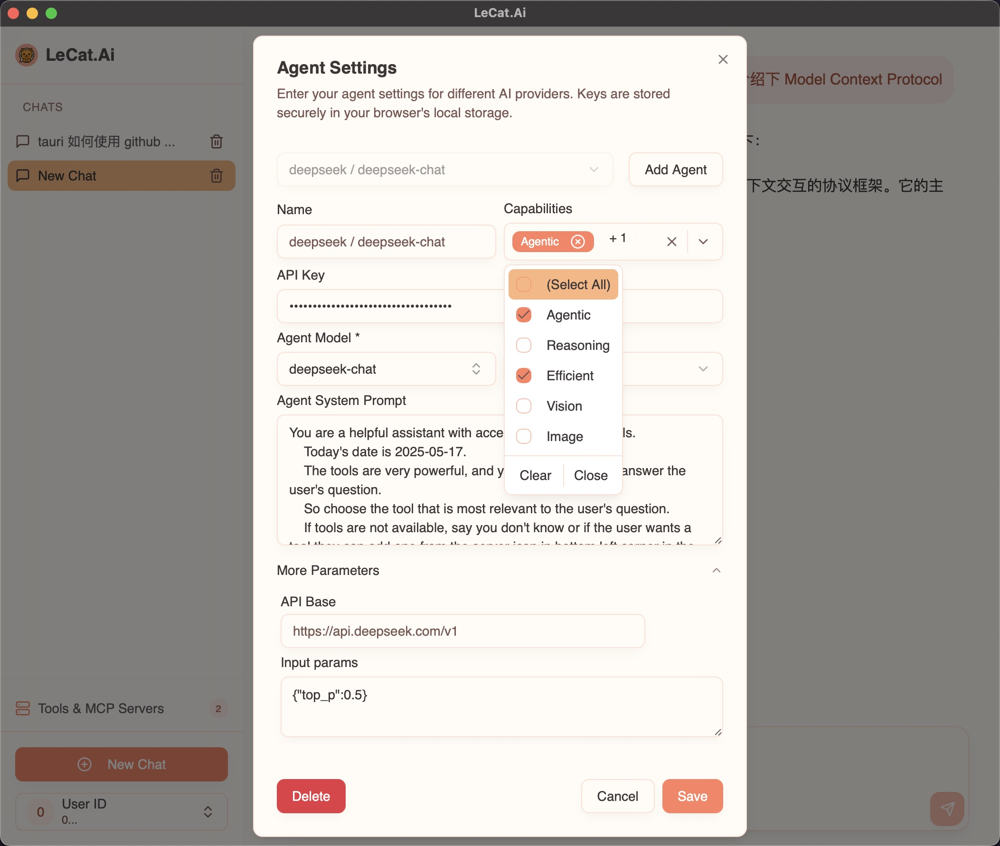
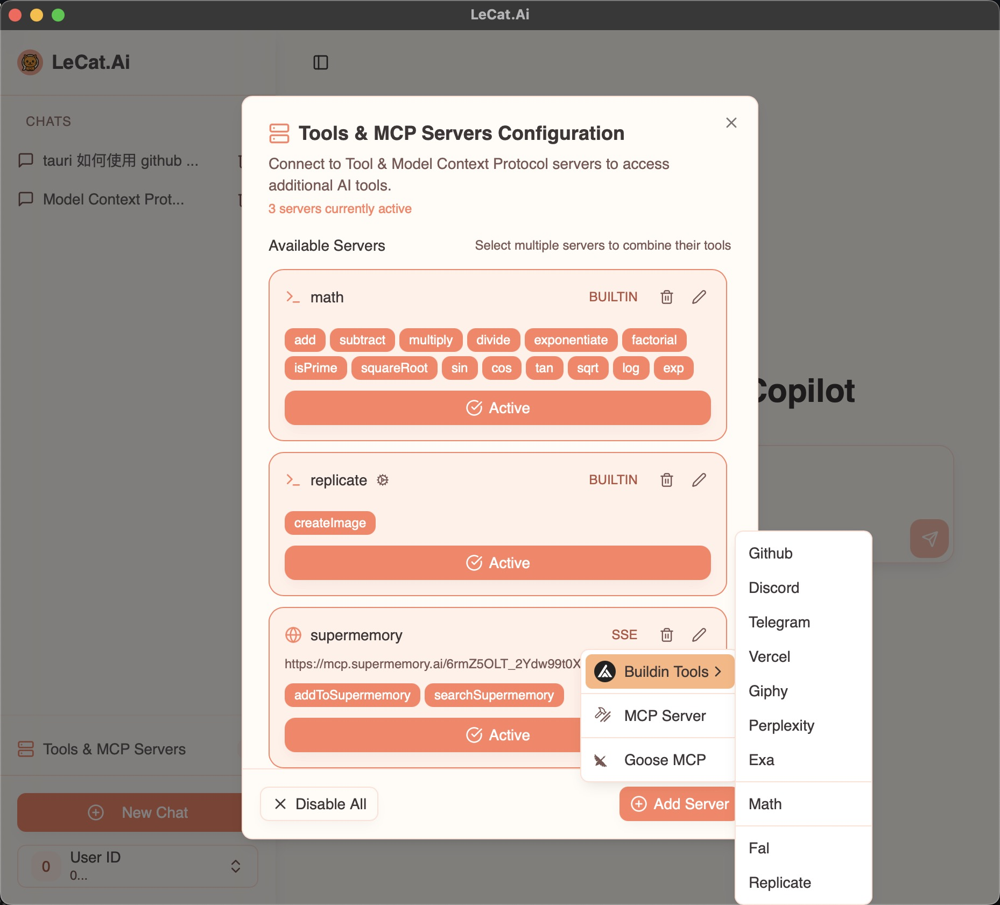

## LeCat.Ai - 智能 AI 助手

LeCat.Ai 是一个功能强大的 AI 助手应用，支持多种 AI 模型和工具，为用户提供全方位的智能服务。

### 主要功能

1. **多模型支持**

   - OpenAI (GPT-4.1, GPT-4, GPT-3.5)
   - Anthropic (Claude 3.7 Sonnet)
   - Groq (Qwen QWQ)
   - XAI (Grok 3)
   - DeepSeek
   - 智谱 AI (GLM-4)
   - 更多模型持续添加中...

2. **多样化能力**

   - 文本生成与对话
   - 代码编写与调试
   - 图像生成
   - 语音转写
   - 语音合成
   - 数学计算
   - 网络搜索
   - 维基百科查询
   - Reddit 内容搜索
   - 新闻搜索

3. **Agent Tools 支持**

   - 自定义 Agent 配置
   - 多模式支持（文本生成、流式响应、对象生成等）
   - 工具链集成
   - 实时状态监控
   - 灵活的 Agent 管理

4. **MCP (Model Context Protocol) 配置**

   - 支持 MCP 协议集成
   - 自定义上下文管理
   - 模型参数配置
   - 实时流式传输
   - 本地化部署支持

5. **跨平台支持**

   - Windows
   - macOS
   - Android (armv7, aarch64)

6. **开发者友好**
   - 支持多种 AI 模型 API 集成
   - 提供完整的开发工具链
   - 支持自定义 Agent 配置
   - 内置多种实用工具

### 技术特点

1. **现代化技术栈**

   - 基于 Tauri + React + AI SDK 构建，结合桌面端和 Web 技术，兼具高性能与良好用户体验
   - Tauri 框架让应用体积极小（通常 < 30MB），资源占用低，启动快
   - React 提供高效的组件化开发体验，易于维护和扩展
   - AI SDK 支持多家主流大模型 API，便于集成和切换
   - 跨平台适配优秀，支持 Windows、macOS、Linux 及移动端
   - 支持实时流式响应和本地数据存储

2. **安全性**

   - API 密钥本地加密存储
   - 支持自定义安全策略
   - 数据隐私保护

3. **可扩展性**
   - 模块化设计
   - 插件系统支持
   - 易于集成新功能

### 开发路线图

1. **近期计划**

   - [ ] 优化移动端体验
   - [ ] 添加更多 AI 模型支持
   - [ ] 增强代码生成能力
   - [ ] 改进用户界面

2. **中期计划**

   - [ ] 支持更多平台
   - [ ] 添加协作功能
   - [ ] 增强本地化支持
   - [ ] 优化性能

3. **长期计划**
   - [ ] 构建 AI 模型市场
   - [ ] 支持自定义模型训练
   - [ ] 提供 API 服务
   - [ ] 建立开发者社区

```

> 下图展示了 LeCat.Ai 的 界面预览：






```
